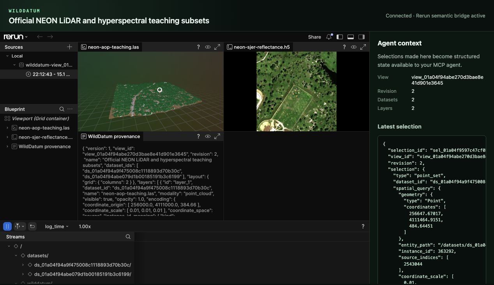
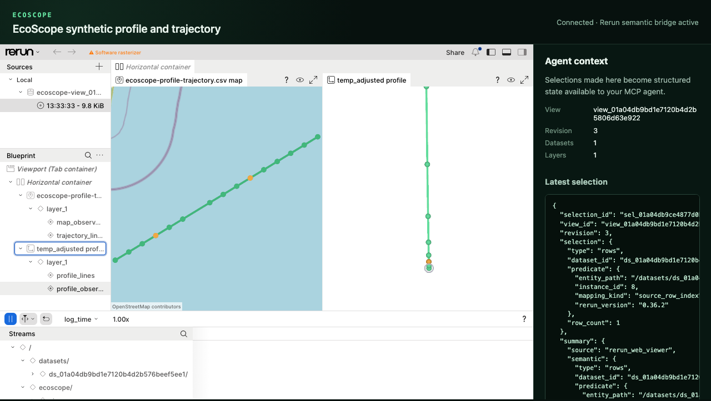
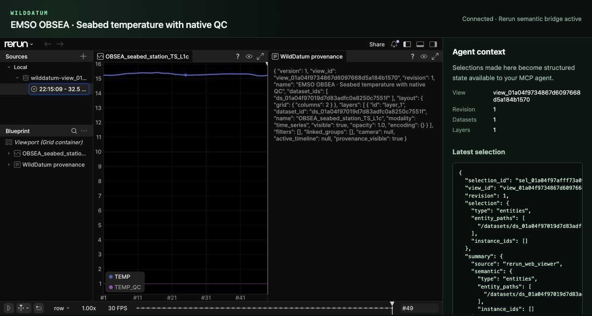

# WildDatum

[](https://github.com/krnzt/wilddatum/actions/workflows/ci.yml)
[](LICENSE)
[](#project-status)

WildDatum is a local-first ecological data workbench exposed as a standard Model
Context Protocol server. It lets Codex, Claude, and other MCP agents discover,
materialize, query, visualize, select, and cite scientific data without putting
credentials, private paths, or millions of rows into model context.

NEON plus public ERDDAP services from EMSO ERIC, ICOS Carbon Portal, and
Euro-Argo/Ifremer are built-in remote providers. Local tabular, raster, vector,
point-cloud, image, hyperspectral, and N-dimensional array sources use the same
provider-independent manifest, query, view, selection, and provenance model.

> “Compare this NEON LiDAR tile with its hyperspectral cube. Show them together,
> let me select an individual return or image pixel, then query the exact source
> point or spectrum behind my selection.”



_A real WildDatum browser session using Rerun Web Viewer: a 6.6-million-point
NEON LAS tile, a 500×500×107 reflectance cube, immutable provenance, and a
verified selection mapped back to LAS source row 2,543,044._

<!-- mcp-name: io.github.krnzt/wilddatum -->

## The human–agent loop

```text
scientific question
    → discover products, sites, and local assets
    → construct and approve a reproducible data plan
    → materialize immutable, checksum-verified sources
    → query and render a bounded multimodal Rerun view
    → human clicks, brushes, filters, or selects
    → WildDatum records that interaction as scientific state
    → agent queries the exact selected source data
    → export results, transformations, provenance, and citation
```

The visualization is not just a picture for the model to inspect. `EcoViewSpec`
is authoritative view state and `SemanticSelection` is authoritative interaction
state. A Rerun recording is a regenerable rendering artifact. For verified
WildDatum point batches, an instance pick maps back to an exact LAS/LAZ source
row; for a mapped cube, an image click maps back to the complete source spectrum.
For linked trajectories and vertical profiles, a map or profile point maps back
to the exact physical CSV/TSV, Parquet, or Arrow record, including
provider-native QC values.

## What works in the alpha

- A normal MCP 2026-07-28 stdio server registerable with Codex and Claude Code.
- Public NEON catalog discovery plus reproducible plan, approval, background
  materialization, checksum, release, license, and citation handling.
- Public EMSO, ICOS ERDDAP, and Euro-Argo catalog discovery plus validated
  tabledap/griddap subsets, redirect-aware approval, streaming materialization,
  license, citation, and live-source provenance.
- Out-of-band local imports with streaming fingerprints and opaque agent-facing
  dataset IDs.
- Arrow/DataFusion tabular queries, spatial raster/vector queries, indexed COPC
  reads, and bounded HDF5/NetCDF/Zarr N-dimensional slices.
- Native and browser Rerun views for tables, images, GeoTIFFs, vectors, LiDAR,
  mapped scientific cubes, and linked geographic trajectories/vertical profiles.
- Durable human selections that can be converted into provenance-linked source
  queries and exported as CSV, Parquet, COG, or RO-Crate where applicable.
- Language-neutral community provider subprocesses with a provider-neutral v2
  JSON-RPC contract; an RI contributor can work in Rust, Python, R, Go, or
  another language without adding provider-specific MCP tools.

## Alpha.3: linked scientific views

The main branch can now inspect the scientific structure of an existing local
or materialized dataset without exposing its private path:

```bash
wilddatum inventory ds_...
wilddatum suggest-views ds_lidar... ds_cube...
wilddatum create-suggested-view suggest_... ds_lidar... ds_cube...
wilddatum resolve-selection-links sel_...
```

The equivalent registered MCP tools are `inspect_scientific_inventory` and
`suggest_views`; `create_view_from_suggestion` accepts one of those opaque
suggestion IDs, and `resolve_selection_links` evaluates applicable rules after
a human selection. Inventories contain bounded fields, arrays, axes, units,
CF/QC relationships, evidence, and unresolved decisions. Suggestions remain
deterministic and side-effect free until accepted. On acceptance WildDatum
recomputes the suggestion, rejects client-invented IDs, and persists an
`EcoViewSpec` v2 with explicit scientific panels, encodings, and versioned link
rules. Existing v1 views remain readable.

For the official NEON teaching pair, WildDatum reads the 107 measured
wavelengths, selects bands nearest 650/550/450 nm, and ranks a 3D point-cloud +
RGB + spectrum workspace first. Cube-pixel → spectrum is marked exact. WildDatum
also extracts LAS WKT/GeoKey CRS metadata and the HDF5 EPSG, `Map_Info`, spatial
extent, scale factor, and no-data value. The teaching cube's `Map_Info` origin
disagrees with its declared reflectance extent by 500 m, and its footprint does
not overlap the teaching LAS tile, so point → image pixel correctly remains
unavailable for that pair instead of pretending that proximity is
registration.

Accepted point-cloud + spectral-cube views render through the same pinned Rerun
adapter and browser explorer as manually created views. The browser reports the
view-spec version and panel/link counts. A cube-pixel pick automatically
materializes its exact wavelength-aware spectrum as a durable result with the
selection and link rule in its provenance. Unavailable link rules remain
visible structured state and create no result rather than becoming guessed
interactions. Link evaluation refuses stale selections after the view revision
changes.

For datasets with the same authoritative CRS, an internally consistent
north-up affine transform, and overlapping footprints, an exact point pick can
now derive the source cube pixel and immediately chain into the complete
wavelength-aware spectrum. The derived pixel, both link decisions, and the
spectrum result remain inspectable through the normal MCP, CLI, and browser
interfaces.

After resolution, the browser regenerates the authoritative view as a complete
Rerun recording with a magenta source/derived pixel marker and the linked
wavelength/value series inside its spectrum panel. The structured selection and
result provenance still drive the overlay; the browser does not reconstruct it
from canvas coordinates.

Linked trajectory/profile views now accept CSV, TSV, Parquet, GeoParquet,
Arrow IPC, and Feather sources. One map can drive up to eight QC-aware value
profiles. Inclusive depth/pressure/height ranges and deterministic per-profile
point budgets reduce visual load while transparent source slots preserve exact
Rerun-instance → physical-record identity for every displayed format.

Detailed support and caveats are in the [format matrix](docs/FORMATS.md). Design
boundaries are documented in [architecture](docs/ARCHITECTURE.md) and
[implementation decisions](docs/DECISIONS.md). Planned Research Infrastructure,
visualization, and deployment work is tracked in the public
[roadmap](ROADMAP.md).

## Install and see it work

The alpha ships self-contained macOS universal and Linux x86-64 packages. You
do not need Rust, Node.js, CMake, or a separate Rerun installation:

```bash
curl -fsSL https://raw.githubusercontent.com/krnzt/wilddatum/v0.1.0-alpha.3/scripts/install.sh | sh
```

The installer verifies the release SHA-256, installs under `~/.local` by
default, and runs `wilddatum setup`. Set `WILDDATUM_INSTALL_DIR` to choose another
prefix. If `~/.local/bin` is not already on your `PATH`, add it before continuing.

Existing EcoScope alpha installations remain readable. WildDatum falls back to
legacy `ECOSCOPE_DATA_DIR`, `ECOSCOPE_CACHE_DIR`, `ECOSCOPE_WEB_DIST`, default
application-data directories, and NEON keychain entries when their WildDatum
equivalents are absent. The installer also leaves an `ecoscope` command alias
when it can do so without replacing a user-owned file.

Create a deterministic LiDAR + hyperspectral demonstration and open it in the
bundled Rerun browser viewer:

```bash
wilddatum demo synthetic
```

The generated LAS and HDF5 files pass through the same import, manifest, cube
mapping, Rerun recording, and selection-query paths as user data. No network or
credentials are needed. An opt-in official NEON teaching-data demonstration is
also available (roughly 224 MiB):

```bash
wilddatum demo neon --accept-download
```

## Register the normal MCP server

WildDatum is published as `io.github.krnzt/wilddatum` in the official MCP
Registry. It is also a normal local stdio server: Codex, Claude Code, and any
compatible host launch the same `wilddatum mcp` process and discover its tools.

```bash
wilddatum register codex
wilddatum register claude
```

Both registration commands are safe to repeat and preserve an existing
WildDatum entry. Platform-specific MCPB bundles are attached to every release
for hosts and registries that install MCPB packages.

Equivalent host commands are:

```bash
codex mcp add wilddatum -- /absolute/path/to/wilddatum mcp
claude mcp add --scope user wilddatum -- /absolute/path/to/wilddatum mcp
```

Generic MCP configuration:

```json
{
  "mcpServers": {
    "wilddatum": {
      "command": "/home/you/.local/bin/wilddatum",
      "args": ["mcp"]
    }
  }
}
```

After registration, the host launches WildDatum like any other local MCP server,
negotiates the protocol, discovers its tools, and receives bounded structured
results rather than bulk scientific files.

## Use local scientific files

```bash
wilddatum import examples/observations.csv
wilddatum datasets
wilddatum preview ds_... --limit 20
wilddatum create-view --name "Site comparison" ds_...
wilddatum open view_...
```

Local paths are selected in the terminal, never passed as an MCP argument. The
private SQLite registry retains the source path; agents receive an opaque ID,
checksum, display name, scientific metadata, and provenance. The same path
supports the raster, vector, point-cloud, image, and cube formats in the
[format matrix](docs/FORMATS.md).

## Linked trajectories and vertical profiles

Profile/trajectory rendering is a validated recipe over ordinary CSV, TSV,
Parquet, GeoParquet, Arrow IPC, or Feather data, not a provider-specific
renderer. Start locally with the deterministic demo:

```bash
wilddatum demo profile-trajectory
```

The agent workflow is the same for a local import or materialized ERDDAP table:

```text
user imports a compatible local table, or agent materializes a provider subset
  → create_view
  → configure_profile_trajectory_view
  → open_view
  → human selects a map or profile observation
  → inspect_view
  → query_selection
  → exact source record with native identifiers, values, units, and QC
```

The recipe explicitly names trajectory/profile identifiers, time, longitude,
latitude, vertical coordinate and direction, one primary plus optional
additional displayed values, units, fill values, and accepted native QC codes.
It can also apply an inclusive source-coordinate vertical range and a
per-profile display budget. WildDatum validates those fields against the source
before authoring the exact-row mapping; the browser cannot declare a source
index trusted, and sampling never changes the source instance slots.



_The shipped synthetic profile demo in Rerun Web Viewer. The selected profile
observation is persisted as a `rows` selection containing only its Rerun entity,
instance, mapping kind, and pinned version; the service independently resolves
that instance to the original delimited source row._

## NEON

Metadata discovery does not require credentials. Exact file planning and
downloads use a NEON API token stored outside model context:

```bash
./target/release/wilddatum connect-neon
```

The prompt does not echo the token. WildDatum stores it in the operating-system
keychain and sends it upstream only in the `X-API-Token` header. Headless systems
can inject `NEON_API_TOKEN` through their secret manager.

`wilddatum doctor` time-boxes its noninteractive keychain probe. A
`neon_connected: null` result with `neon_credential_probe: "timed_out"` means the
operating system did not answer the readiness probe; it does not expose or erase
the stored credential.

## Public ERDDAP infrastructures

The normal registered MCP exposes three credential-free public presets through
the same tools used for NEON and community providers:

| Provider ID | Public surface | Boundary |
|---|---|---|
| `emso` | [EMSO ERIC ERDDAP](https://erddap.emso.eu/erddap/) | Federated public datasets; approved redirect chains identify the regional server that returns the bytes |
| `icos-erddap` | [ICOS Carbon Portal ERDDAP](https://erddap.icos-cp.eu/erddap/) | Public ERDDAP only; authenticated Carbon Portal objects are a separate future integration |
| `euro-argo` | [Ifremer ERDDAP](https://erddap.ifremer.fr/erddap/) | Catalog search is scoped to Argo/Euro-Argo data on the shared service |

An agent can call `search_catalog` and `inspect_resource` without credentials,
then construct a typed table subset:

```json
{
  "provider": "emso",
  "resource_id": "OBSEA_seabed_station_TS_L1c",
  "variables": ["time", "TEMP", "TEMP_QC"],
  "temporal_start": "2025-01-01T00:00:00Z",
  "temporal_end": "2025-01-02T00:00:00Z",
  "provider_options": {
    "protocol": "tabledap",
    "output_format": "csv",
    "constraints": [
      {"variable": "TEMP_QC", "op": "eq", "value": 1}
    ]
  }
}
```

That is the input to `plan_materialization`; planning does not download the
dataset. WildDatum validates every variable against ERDDAP `info` metadata,
translates neutral temporal bounds into `time` constraints for tabledap, probes
the exact redirect chain, and returns one URL for approval. Call `approve_plan`
with the returned hash and then `materialize_dataset`. The stored object is named
by its BLAKE3 digest, while the manifest retains the decoded query, redirect
chain, ETag, Last-Modified value, access time, server version, global attributes,
variable-level CF attributes, license, and citation. Downloads stream through a
configurable hard byte ceiling (512 MiB by default) and failed or oversized
partials are removed.

Grid subsets use `protocol: "griddap"` and explicit arrays. Each axis can use
integer indices or ERDDAP value coordinates:

```json
{
  "protocol": "griddap",
  "output_format": "netcdf",
  "arrays": [{
    "variable": "temperature",
    "slices": [
      {"start": "0", "stop": "23", "stride": 1},
      {"start": "10", "stop": "30", "stride": 2}
    ]
  }]
}
```

ERDDAP subsets are live generated results rather than fixed releases. File size
is generally unknown at approval time, so constrain variables, rows, time, and
grid axes carefully. Materialization freezes the exact returned bytes locally;
repeating the same upstream query later may produce a different checksum.



_A real EMSO workflow executed through WildDatum's registered stdio MCP:
`plan_materialization` → `approve_plan` → `materialize_dataset` → `create_view`
→ `render_view`. The browser shows the public OBSEA temperature and native QC
channels, the regenerable `EcoViewSpec`, and selection events returned as
structured agent context._

## Multidimensional data

WildDatum inventories cube arrays without guessing ambiguous scientific meaning.
When X, Y, and spectral axes are unambiguous, common NEON reflectance conventions
are inferred. Otherwise the mapping is explicit and revisioned:

```bash
./target/release/wilddatum configure-cube view_... \
  --layer-id layer_1 \
  --cube-array /SITE/Reflectance/Reflectance_Data \
  --y-axis 0 --x-axis 1 --spectral-axis 2 \
  --wavelength-dataset /SITE/Reflectance/Metadata/Spectral_Data/Wavelength \
  --red-band 14 --green-band 9 --blue-band 5
```

The provider-neutral MCP equivalent is `configure_cube_view`.

## Community providers

The maintained remote providers are built in, but the architecture is not
institution-shaped. Install a trusted
language-neutral provider executable with:

```bash
./target/release/wilddatum provider install ./my-provider.json
./target/release/wilddatum provider list
```

Installation performs a protocol handshake and validates provider identity,
capabilities, response bounds, and declared HTTPS origins. Provider executables
are trusted local code, not sandboxed plugins, and never receive credential
values. See the [provider SDK](docs/PROVIDER_SDK.md) for the complete wire
contract, conformance fixture, and security model. The canonical
[`DatasetRequest` v2](schemas/dataset-request-v2.schema.json) and
[provider manifest v2](schemas/provider-manifest-v2.schema.json) schemas keep
RI-native names inside adapters while `plan_materialization` exposes one typed
MCP input across providers.

## Known limitations

- WildDatum is local stdio MCP today; remote Streamable HTTP and OAuth are not
  implemented yet.
- The alpha macOS executables are not Apple-notarized. macOS may require an
  explicit first-run approval; release checksums still protect artifact integrity.
- The browser explorer uses Rerun's WebGL renderer for reliable software and CI
  support. Native Rerun remains the higher-ceiling surface for very large scenes.
- Rerun exposes entity/instance selection events, but not one universal brush
  protocol for every view. Explicit interval, map, raster, spectral, and row
  selections use the same `record_selection`/`query_selection` path.
- GeoParquet supports exact GeoDataFusion queries but not direct geometry logging
  into Rerun yet; GeoPackage currently has inspection but no query adapter.
- WildDatum-derived COPC indexes provide full-resolution spatial access but do
  not yet contain a provider-quality multiresolution hierarchy.
- Generic ERDDAP planning does not infer institution-specific station/location
  dimensions or translate arbitrary polygons. Use typed tabledap constraints or
  griddap slices. CF profile roles are preserved, but choosing the scientific
  value/QC policy remains an explicit recipe rather than an automatic guess.
- Linked profile rendering currently accepts CSV/TSV, one displayed value field,
  and at most 100,000 source rows. Rerun's raw-value 2D aspect can make a narrow
  value range look horizontally compressed against a deep vertical range.
- The pure-Rust NetCDF-3 adapter bounds whole-variable decoding because its
  reader does not currently provide subset I/O.

## Development

Building from source requires Rust 1.95, Node.js 22, CMake, and a C/C++
compiler. Linux uses a vendored static D-Bus client for keychain access.

```bash
git clone https://github.com/krnzt/wilddatum.git
cd wilddatum
npm --prefix viewer/web-bootstrap ci
npm --prefix viewer/web-bootstrap run build
cargo build --release
./target/release/wilddatum setup
```

Run the complete validation suite with:

```bash
cargo fmt --check
cargo clippy --workspace --all-targets -- -D warnings
cargo test --workspace
npm --prefix viewer/web-bootstrap run check
npm --prefix viewer/web-bootstrap run build
npm --prefix viewer/web-bootstrap exec -- playwright install chromium
npm --prefix viewer/web-bootstrap run test:e2e
npm --prefix viewer/web-bootstrap audit --omit=dev
```

An opt-in integration test exercises published NEON teaching subsets: a
6,609,829-point LAS tile and a 500×500×107 HDF5 reflectance cube.

```bash
curl -fL -o /tmp/neon-point-cloud.las https://ndownloader.figshare.com/files/7024955
curl -fL -o /tmp/neon-hyperspectral.h5 https://ndownloader.figshare.com/files/21754221
NEON_POINT_CLOUD_FIXTURE=/tmp/neon-point-cloud.las \
NEON_HYPERSPECTRAL_FIXTURE=/tmp/neon-hyperspectral.h5 \
cargo test -p wilddatum-rerun --test official_neon_fixtures -- --ignored
```

The maintained ERDDAP presets also have opt-in live drift checks. They search
and inspect all three services, materialize a tiny redirected EMSO subset, and
run a bounded current Euro-Argo profile through CF discovery, materialization,
recipe validation, and Rerun rendering:

```bash
cargo test -p wilddatum-provider-erddap --test live -- --ignored
cargo test -p wilddatum-provider-erddap --test argo_profile_smoke -- --ignored
```

Build local MCPB and archive artifacts after the Rust and browser builds with
`scripts/package-release.sh target/release/wilddatum dist macos-arm64 darwin`
(substitute `linux-x86_64 linux` on Linux). The tag workflow builds and combines
both macOS architectures, verifies the Linux linkage, publishes checksummed
release assets, and submits the generated `server.json` using GitHub OIDC.

## Project status

WildDatum is an early public alpha. The scientific data model, provider contract,
and Rerun boundary are designed for extension, but APIs and packaging may still
change before the first stable release.

Contributions are welcome from ecological researchers, data stewards, Research
Infrastructure teams, visualization developers, and scientific-format experts.
Good first collaborations include representative metadata fixtures, format
adapters, selection semantics, accessibility, and reproducible ecological
demonstrations. Read [CONTRIBUTING.md](CONTRIBUTING.md) and open an issue before
starting a large provider or viewer change.

WildDatum is MIT licensed. Rerun is used under its MIT/Apache-2.0 license; built
bundles retain the required notices in [THIRD_PARTY_NOTICES.md](THIRD_PARTY_NOTICES.md).
