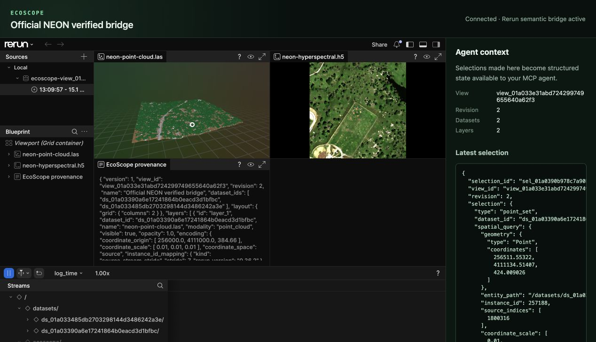

# EcoScope

[](https://github.com/krnzt/ecoscope/actions/workflows/ci.yml)
[](LICENSE)
[](#project-status)

EcoScope is a local-first ecological data workbench exposed as a standard Model
Context Protocol server. It lets Codex, Claude, and other MCP agents discover,
materialize, query, visualize, select, and cite scientific data without putting
credentials, private paths, or millions of rows into model context.

NEON is the first built-in remote provider. Local tabular, raster, vector,
point-cloud, image, hyperspectral, and N-dimensional array sources use the same
provider-independent manifest, query, view, selection, and provenance model.

> “Compare this NEON LiDAR tile with its hyperspectral cube. Show them together,
> let me select an individual return or image pixel, then query the exact source
> point or spectrum behind my selection.”



_A real EcoScope browser session using Rerun Web Viewer: a 6.6-million-point
NEON LAS tile, a 500×500×107 reflectance cube, immutable provenance, and a
verified selection mapped back to LAS source row 1,800,316._

<!-- mcp-name: io.github.krnzt/ecoscope -->

## The human–agent loop

```text
scientific question
    → discover products, sites, and local assets
    → construct and approve a reproducible data plan
    → materialize immutable, checksum-verified sources
    → query and render a bounded multimodal Rerun view
    → human clicks, brushes, filters, or selects
    → EcoScope records that interaction as scientific state
    → agent queries the exact selected source data
    → export results, transformations, provenance, and citation
```

The visualization is not just a picture for the model to inspect. `EcoViewSpec`
is authoritative view state and `SemanticSelection` is authoritative interaction
state. A Rerun recording is a regenerable rendering artifact. For verified
EcoScope point batches, an instance pick maps back to an exact LAS/LAZ source
row; for a mapped cube, an image click maps back to the complete source spectrum.

## What works in the alpha

- A normal MCP 2026-07-28 stdio server registerable with Codex and Claude Code.
- Public NEON catalog discovery plus reproducible plan, approval, background
  materialization, checksum, release, license, and citation handling.
- Out-of-band local imports with streaming fingerprints and opaque agent-facing
  dataset IDs.
- Arrow/DataFusion tabular queries, spatial raster/vector queries, indexed COPC
  reads, and bounded HDF5/NetCDF/Zarr N-dimensional slices.
- Native and browser Rerun views for tables, images, GeoTIFFs, vectors, LiDAR,
  and mapped scientific cubes.
- Durable human selections that can be converted into provenance-linked source
  queries and exported as CSV, Parquet, COG, or RO-Crate where applicable.
- Language-neutral community provider subprocesses with a versioned JSON-RPC
  contract; an RI contributor can work in Rust, Python, R, Go, or another
  language without adding provider-specific MCP tools.

Detailed support and caveats are in the [format matrix](docs/FORMATS.md). Design
boundaries are documented in [architecture](docs/ARCHITECTURE.md) and
[implementation decisions](docs/DECISIONS.md).

## Five-minute local demo

### Requirements

- Rust 1.95 or later; the repository pins the toolchain.
- CMake and a C/C++ compiler for the statically linked HDF5 reader.
- Node.js 22 or later to build the browser viewer.
- Linux builds also require `pkg-config` and the D-Bus development headers
  (`libdbus-1-dev` on Debian or Ubuntu) for native keychain integration.

### Build

```bash
git clone https://github.com/krnzt/ecoscope.git
cd ecoscope
npm --prefix viewer/web-bootstrap ci
npm --prefix viewer/web-bootstrap run build
cargo build --release
./target/release/ecoscope setup
```

### Import and inspect a local table

```bash
./target/release/ecoscope import examples/observations.csv
./target/release/ecoscope datasets
./target/release/ecoscope preview ds_... --limit 20
./target/release/ecoscope create-view --name "Site comparison" ds_...
./target/release/ecoscope open view_...
```

Local paths are selected in the terminal, never passed as an MCP argument. The
private SQLite registry retains the source path; agents receive an opaque ID,
checksum, display name, scientific metadata, and provenance.

## Register as an MCP server

```bash
./target/release/ecoscope register codex
./target/release/ecoscope register claude
```

Equivalent host commands are:

```bash
codex mcp add ecoscope -- /absolute/path/to/ecoscope mcp
claude mcp add --scope user ecoscope -- /absolute/path/to/ecoscope mcp
```

Generic MCP configuration:

```json
{
  "mcpServers": {
    "ecoscope": {
      "command": "/absolute/path/to/ecoscope",
      "args": ["mcp"]
    }
  }
}
```

After registration, the host launches EcoScope like any other local MCP server,
negotiates the protocol, discovers its tools, and receives bounded structured
results rather than bulk scientific files.

## NEON

Metadata discovery does not require credentials. Exact file planning and
downloads use a NEON API token stored outside model context:

```bash
./target/release/ecoscope connect-neon
```

The prompt does not echo the token. EcoScope stores it in the operating-system
keychain and sends it upstream only in the `X-API-Token` header. Headless systems
can inject `NEON_API_TOKEN` through their secret manager.

## Multidimensional data

EcoScope inventories cube arrays without guessing ambiguous scientific meaning.
When X, Y, and spectral axes are unambiguous, common NEON reflectance conventions
are inferred. Otherwise the mapping is explicit and revisioned:

```bash
./target/release/ecoscope configure-cube view_... \
  --layer-id layer_1 \
  --cube-array /SITE/Reflectance/Reflectance_Data \
  --y-axis 0 --x-axis 1 --spectral-axis 2 \
  --wavelength-dataset /SITE/Reflectance/Metadata/Spectral_Data/Wavelength \
  --red-band 14 --green-band 9 --blue-band 5
```

The provider-neutral MCP equivalent is `configure_cube_view`.

## Community providers

NEON is built in, but the architecture is not NEON-shaped. Install a trusted
language-neutral provider executable with:

```bash
./target/release/ecoscope provider install ./my-provider.json
./target/release/ecoscope provider list
```

Installation performs a protocol handshake and validates provider identity,
capabilities, response bounds, and declared HTTPS origins. Provider executables
are trusted local code, not sandboxed plugins, and never receive credential
values. See the [provider SDK](docs/PROVIDER_SDK.md) for the complete wire
contract, conformance fixture, and security model.

## Known limitations

- EcoScope is local stdio MCP today; remote Streamable HTTP and OAuth are not
  implemented yet.
- Rerun exposes entity/instance selection events, but not one universal brush
  protocol for every view. Explicit interval, map, raster, spectral, and row
  selections use the same `record_selection`/`query_selection` path.
- GeoParquet supports exact GeoDataFusion queries but not direct geometry logging
  into Rerun yet; GeoPackage currently has inspection but no query adapter.
- EcoScope-derived COPC indexes provide full-resolution spatial access but do
  not yet contain a provider-quality multiresolution hierarchy.
- The pure-Rust NetCDF-3 adapter bounds whole-variable decoding because its
  reader does not currently provide subset I/O.

## Development

```bash
cargo fmt --check
cargo clippy --workspace --all-targets -- -D warnings
cargo test --workspace
npm --prefix viewer/web-bootstrap run check
npm --prefix viewer/web-bootstrap run build
npm --prefix viewer/web-bootstrap audit --omit=dev
```

An opt-in integration test exercises published NEON teaching subsets: a
6,609,829-point LAS tile and a 500×500×107 HDF5 reflectance cube.

```bash
curl -fL -o /tmp/neon-point-cloud.las https://ndownloader.figshare.com/files/7024955
curl -fL -o /tmp/neon-hyperspectral.h5 https://ndownloader.figshare.com/files/21754221
NEON_POINT_CLOUD_FIXTURE=/tmp/neon-point-cloud.las \
NEON_HYPERSPECTRAL_FIXTURE=/tmp/neon-hyperspectral.h5 \
cargo test -p ecoscope-rerun --test official_neon_fixtures -- --ignored
```

Build a local MCPB bundle after the Rust and browser builds with
`scripts/build-mcpb.sh`.

## Project status

EcoScope is an early public alpha. The scientific data model, provider contract,
and Rerun boundary are designed for extension, but APIs and packaging may still
change before the first stable release.

Contributions are welcome from ecological researchers, data stewards, Research
Infrastructure teams, visualization developers, and scientific-format experts.
Good first collaborations include representative metadata fixtures, format
adapters, selection semantics, accessibility, and reproducible ecological
demonstrations. Read [CONTRIBUTING.md](CONTRIBUTING.md) and open an issue before
starting a large provider or viewer change.

EcoScope is MIT licensed. Rerun is used under its MIT/Apache-2.0 license; built
bundles retain the required notices in [THIRD_PARTY_NOTICES.md](THIRD_PARTY_NOTICES.md).
